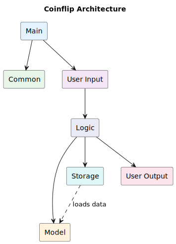
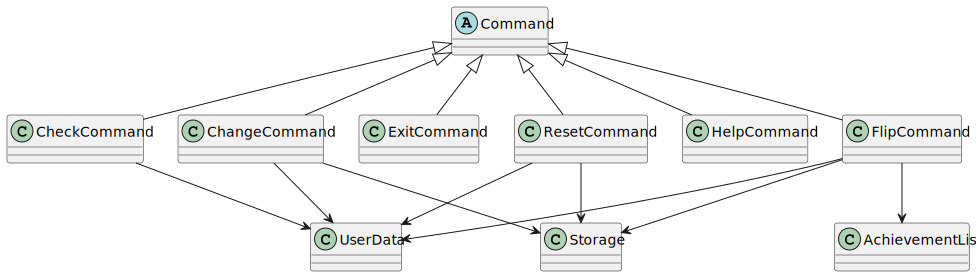
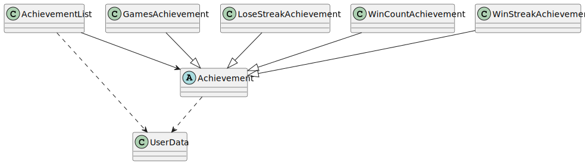
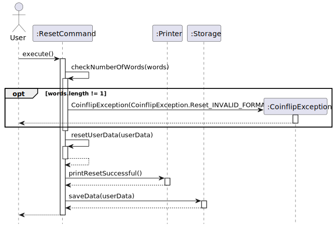
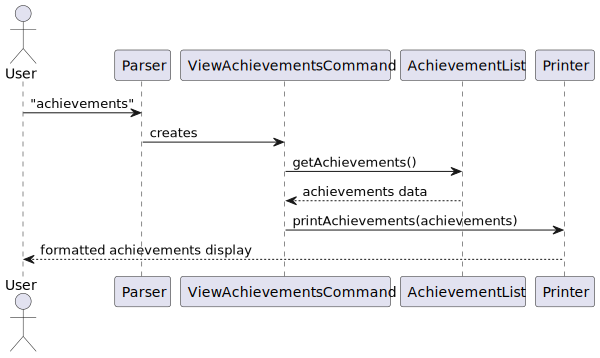

# Developer Guide

## Acknowledgements

Third-party Libraries Used:

* Java SE 17 - Core Java platform
* JUnit 5 - Unit testing framework
* Gradle - Build automation framework for continuous integration (CI) checks
* Mockito - Mocking framework to test save file loading/storing
* PlantUML - For generating UML diagrams

## Setting up, getting started

### Prerequisites

* JDK 17
* Gradle (the project includes a Gradle wrapper, so you don't need to install Gradle separately)
* Any mainstream operating system (Windows, macOS, Linux)

### Setting up the project in IntelliJ IDEA

1. **Ensure you have JDK 17 installed**
    * You can download it from [Oracle](https://www.oracle.com/java/technologies/javase/jdk17-archive-downloads.html)
    * Verify your installation and Java version by running 'java -version' in your terminal

2. **Fork and Clone the repository**
    * Fork and clone this repository to your local machine

3. **Import the project as a Gradle project**
    * Launch IntelliJ IDEA
    * Select 'Import Project'
    * Navigate to the project directory and select the 'build.gradle' file
    * Click 'Open as Project'
    * In the dialog that appears, select 'Use gradle 'wrapper' task configuration' and click 'OK'
    * Wait for the import to complete and for IntelliJ to index the files

4. **Verify the setup**
    * Locate the `src/main/java/seedu/coinflip/Coinflip.java` file in the Project Explorer
    * Right-click on the file and select 'Run Coinflip.main()'
    * If the setup is correct, you should see the Coinflip application starting in the console
    * Try a few commands and run the tests to ensure they all pass

### Project structure

* `src/main/java` - Contains the source code for the application
    * `seedu.coinflip` - Main package
        * `utils` - Utility classes
            * `command` - Command classes for handling user commands
            * `achievement` - Achievement tracking system
            * `animation` - Animation-related classes
            * `exceptions` - Custom exceptions
            * `logger` - Logging facility
            * `parser` - Input parsing
            * `printer` - Output formatting
            * `storage` - Data persistence
            * `userdata` - User data management
* `src/test/java ` - Contains test cases
* `text-ui-test` - Contains console-based testing

### Configuration

The application stores its data in a CSV file in the 'data' directory, which will be automatically
created if it doesn't exist already. No additional configuration is necessary for basic usage.

## Design

### Architecture

Below is the high level architecture of Coinflip:

Here are the components that comprises Coinflip (with a brief description):

* `Main`: Handles interactions between the other components
* `Common`: Common utilities used by all other components (logger, exceptions)
* `Model`: Represents user data in memory when program is running
* `Storage`: Handles loading and saving of user data
* `User Input`: Handles receiving of user input and classification into relevant command
* `Logic`: Handles logic for each command
* `User Output`: Handles creation of visible outputs for the user

To provide a general sequence of interactions, here is the abstract component-level algorithm:

Before starting the main program loop,

* `Storage` reads the save file and loads the data into `Model`

Then the main program loop begins:

* `User Input` waits for a line of input from the user, and decides what command to execute, throwing an exception if no
  command can be executed
* `Logic` executes the logic for each command, typically involving access or modification to `Model`, as well as the
  usage of `Storage` (to save the modified `Model`) as well as `User Output`
    * `User Input` and `Main` store references to `Storage` and `Model` precisely so that they can be passed to `Logic`
* `User Output` handles the final printing of information or error messages to be viewed by the user.

We will go into more detail on the class(es) that comprises each component in their own sections.

### Commons

Consists of the following classes:

* `CoinflipException`: Exception class for all Coinflip related errors
* `CoinFlipFileException`: Exception class specifically for save-file related errors
* `CoinflipLogger`: Handles logging of program events for developers

`CoinflipLogger` is used to log the behaviour of Coinflip at all stages, and is thus used in the code at all levels of
abstraction.

On the other hand, `CoinflipException` and its subclass `CoinflipFileException` are used to denote when there are user
input or save file related errors respectively. When thrown, the `Coinflip` app will generally handle them by printing
the message stored in the exception.

### Main Component

Consists of the following classes:

* `Coinflip`: Handles the sequence of events that occur for each of the other components

`Coinflip` stores references to the classes in the Model and Storage components.

### User Output Component

Consists of the following classes:

* `Printer`: Handles printing of output for the user
* `Animation` (circled A for abstract) and subclasses: Handles printing of animated output, used only by `Printer`

### User Input Component

Consists of the following classes:

* `Parser`: Parses user input and executes relevant commands

### Logic Component

Consists of the following classes:

* `Command` (circled A for abstract) and subclasses: Handles logic and output for each command

### Model Component

Consists of the following classes:

* `UserData`: Abstraction for the user's data (number of coins, bet amounts, etc.)
* `Achievement` and subclasses: Abstraction for achievements (win streak of 100, playing 100 games, etc.)
* `AchievementList`: Abstraction for a list of all achievements

### Storage Component

Consists of the following classes:

* `Storage`: Creates, writes to and reads from save file

## Implementation

This section describes how key Coinflip features are implemented
> Note: In the following sequence diagrams, some of the other classes (for examples, Parser and Logger), or the
> functions the other classes call, have been left out intentionally to reduce cluttering and place more emphasis
> on the respective command classes that are being executed, along with their main functionalities.
>
> The logging functions have also been left out from the steps to focus on the main functionality of each feature.

### Help command

**Viewing available commands (help function)**

Below are the steps taken when the user types in "help" to view all available commands, focusing on the
`HelpCommand` class:

1. The user enters "help" into the command line.
2. The `Parser` class parses the input and creates an instance of `HelpCommand`.
3. The `execute()` method of the `HelpCommand` class is called.
4. The `execute()` method calls the `checkNumberOfWords(words)` method to ensure that exactly 1 word was entered.
   Exceptions will be thrown if the input is found to have more than 1 word.
5. The `execute()` method will then call the `printHelp()` method from the `Printer` class to print the different
   available commands.
6. The control is returned to the user, who is free to enter the next command.

The following sequence diagram shows how the `HelpCommand` class is executed when the user types in "help" to view
all available commands.

### Check command

**Viewing balance, bet or history (check command)**

Below are the steps taken when the user types in "check ___" (where the ___ can be "balance", "bet" or "history")
to view their balance, bet amount or history, focusing on the `CheckCommand` class.

1. The user enters "check ___" into the command line.
2. The `Parser` class parses the input and creates an instance of `CheckCommand`.
3. The `execute()` method of the `CheckCommand` class is called.
4. The `execute()` method calls the `checkNumberOfWords(words)` method to ensure that exactly 2 words were entered.
   Exceptions will be thrown if the input is found to have more than or less than 2 words.
5. The `execute()` method will then call the `check(words[1])` function to check the second word of the input
   to determine which command to execute. If the second word of the input is not "balance", "bet", or "history",
   an exception will be thrown.
6. The commands that were chosen to execute will then print their respective messages.
7. The control is returned to the user, who is free to enter the next command.

The following sequence diagram shows how the `CheckCommand` class is executed when the user types in "check ___"
(where the ___ can be "balance", "bet" or "history") to view their balance, bet amount or history.

### Flip command

**Playing coinflip (flip command)**

Below are the steps taken when the user types in "flip heads" or "flip tails" to play a coin flip, focusing on the
`FlipCommand` class.

1. The user enters "flip heads" or "flip tails" into the command line.
2. The `Parser` class parses the input and creates an instance of `FlipCommand`.
3. The `execute()` method of the `FlipCommand` class is called.
4. The `execute()` method calls the `flip()` method.
5. The `flip()` method calls a number of functions to check the validity of the user input and ensures the user
   has sufficient balance to place the bet. Exceptions will be thrown if the input is found to be invalid or the user
   is found to have insufficient balance.
6. The generateFlip() method is called to generate a random outcome of the coin flip. *The call to randomly
   generate a flip has been intentionally left out from the sequence diagram to emphasise the ChangeCommand class.*
7. The `getOutcome(actualFlip, words[1])` method will then check if the user has won or lost the coin flip.
8. The `update(userData, outcome)` method of the `AchievementList` class is called to update the user's
   achievements. *This function has been intentionally left out of the sequence diagram to place emphasis on the
   ChangeCommand class.*
9. The `processOutcome()` method will be called, which will call other functions to update the user's data.
   *These functions have been intentionally left out of the sequence diagram so that it will be less cluttered*
10. The `printFlipOutcome(actualFlip, outcome, userData.betAmount)`, `printFlipSummary(userData)` and
    `printUnlockedAchievements(achievementList)` methods from the `Printer` class will be called to print the outcomes
    of the flip and achievements obtained (if any) *The printFlipOutcome calls other functions to show an animation of
    a coin flipping, but they have been left out of the sequence diagram to place emphasis on the ChangeCommand class.*
11. The data will be saved to the save file using the `Storage` class. *This step has been left out from the
    sequence diagram to place emphasis on the ChangeCommand class.*

12. The control is returned to the user, who is free to enter the next command.

The following sequence diagram shows how the `FlipCommand` class is executed when the user types in "flip heads"
or "flip tails" to play a coin flip.

### Change command

**Changing betting amount (change command)**

Below are the steps taken when the user types in "change BET_AMOUNT" (where BET_AMOUNT is the new amount the user
would like to bet) to change the betting amount, focusing on the `ChangeCommand` class.

1. The user enters "change BET_AMOUNT" into the command line.

2. The `Parser` class parses the input and creates an instance of `ChangeCommand`.

3. The `execute()` method of the `ChangeCommand` class is called.

4. The `execute()` method calls the `change()` method.

5. The `change()` method calls a number of functions to check the validity of the user input and
   exceptions will be thrown if the input is found to be invalid.
   Such functions include: `checkNumberOfWords(words)`, `checkNumerical(words[1])`, `checkCanBeInteger(words[1])`,
   `checkNonNegative(betAmount)`, and `checkWithinBalance(betAmount, userData.balance)`.
   For the `checkNonNegative(betAmount)` and `checkWithinBalance(betAmount, userData.balance`, `words[1]` is converted
   from a string to an integer and stored in the `betAmount` variable.
6. Once the BET_AMOUNT has been confirmed to be valid, the `change()` method will set the `betAmount` variable
   in userData to be the BET_AMOUNT specified by the user.
7. The `change()` method will then call the `printBetAmount()` method from the `Printer` class
   to print the message confirming the change in bet amount.
8. The data will be saved to the save file using the `Storage` class. *This step has been left out from the
   sequence diagram to place emphasis on the ChangeCommand class.*
9. The control is returned to the user, who is free to enter the next command.

The following sequence diagram shows how the `ChangeCommand` class is executed when the user types
in "change BET_AMOUNT" to change the betting amount.

### Reset command

**Starting a new game (reset command)**

Below are the steps taken when the user types in "reset" to reset the game, focusing on the `ResetCommand` class.

1. The user enters "reset" into the command line.
2. The `Parser` class parses the input and creates an instance of `ResetCommand`.
3. The `execute()` method of the `ResetCommand` class is called.
4. The `execute()` method calls the `checkNumberOfWords(words)` method to ensure that exactly 1 word was entered.
   Exceptions will be thrown if the input is found to have more than 1 word.
5. The `execute()` method will then call the `resetUserData(userData)` function to reset the user's data.
6. The `execute()` method will then call the `printResetSuccessful()` method from the `Printer` class to print the
   message confirming the reset of the game.
7. The data will be saved to the save file using the `saveData(userData)` method from the `Storage` class.
8. The control is returned to the user, who is free to enter the next command.

The following sequence diagram shows how the `ResetCommand` class is executed when the user types in "reset" to
reset the game.

### Exit command

**Terminating program (exit command)**

Below are the steps taken when the user types in "exit" to terminate the program, focusing on the `ExitCommand`
class.

1. The user enters "exit", or "exit ___"  (where the ___ can be input like other words) into the command line.
2. The `Parser` class parses the input and creates an instance of `ExitCommand`.
3. The `execute()` method of the `ExitCommand` class is called.
4. The `execute()` method calls the `checkNumberOfWords(words)` function to check if the number of words is 1.
   If the user entered "exit ___", or any other input with more than 1 word, an exception will be thrown.
5. The `execute()` method will call the printBye() method from the `Printer` to print the exit message.
6. The `isExit` boolean will then be set to true and the programme will be terminated.

The following sequence diagram shows how the `ExitCommand` class is executed when the user types in "exit" to terminate
the program:

### [Proposed] View Achievements command

The proposed (not yet implemented) view achievements feature would allow users to see all achievements they've unlocked
and those still locked.
This feature is facilitated by creating a new `ViewAchievementsCommand` class that extends the `Command` abstract class.

The implementation will involve

1. Creating a new command class in the command package
2. Enhancing the `AchievementList` class to track locked / unlocked achievements
3. Adding a new printer method to display achievements in a structured format

The sequence diagram below shows how the view achievements command would work:

## Appendix A: Product scope

### Target user profile

Children who are not of age to gamble, specifically children from ages 12-15. Hence, we ensured that the messages
printed out were clear without too many technical terms so that the product would be tailored to our target audience.

### Value proposition

The app will allow children to simulate a gambling environment without using actual money
like some games on the App Store. This will be done by allowing them to bet in-game currency
on a coin flip, and educate them about the dangers of gambling.

## Appendix B: User Stories

| Version | As a ...   | I want to ...                                       | So that I can ...                                                                         |
|---------|------------|-----------------------------------------------------|-------------------------------------------------------------------------------------------|
| v1.0    | new player | start the game with a fixed amount of virtual money | experience the consequences of gambling                                                   |
| v1.0    | new player | view all the commands I can use                     | use the programme as intended                                                             |
| v1.0    | new player | view my current virtual money balance               | know how much I can bet on my next coinflip                                               |
| v1.0    | new player | choose different betting amounts                    | see how risky bets affect my virtual balance                                              |
| v1.0    | new player | randomly win or lose money when gambling            | experience the unpredictability of gambling                                               |
| v1.0    | user       | continue my coin balance from my previous session   | the wins or losses from my previous bets are permanent to me                              |
| v2.0    | user       | view my previous coinflip results                   | see the long-term effect of my playing                                                    |
| v2.0    | user       | save my data between sessions                       | continue experiencing the effects of my actions over a long time period                   |
| v2.0    | user       | have a loading animation when I flip coins          | see the parallels to real-world gambling (by having added realism)                        |
| v2.1    | user       | be able to start a new game                         | continue playing when my coin balance is 0                                                |
| v2.1    | user       | unlock achievements upon achieving certain actions  | feel rewarded for using the program, similar to how manipulative casinos are in real life |

## Appendix C: Non-Functional Requirements

* Should work on any _mainstream_ OS with Java 17 installed.
* A user with decent typing speed for normal text should be able to complete most tasks faster through typing out
  commands, compared to using the mouse to navigate a GUI application.

## Appendix D: Glossary

* *balance* - Number of coins possessed by the user
* *win* - When a user successfully predicts the outcome of a coin flip
* *lose* - When a user does not successfully predict the outcome of a coin flip
* *win streak* - Number of consecutive successful coin flips performed by the user
* *lose streak* - Number of consecutive unsuccessful coin flips performed by the user

## Appendix E: Instructions for Manual Testing

Viewing available commands

* Format: `help`
* Features: Shows available functions

Viewing balance

* Format: `check balance`
* Feature: Shows balance available to be used for betting

Viewing statistics of previous flips

* Format: `check history`
* Feature: Shows statistics for all previous coinflips

Viewing bet amount

* Format: `check bet`
* Feature: Shows bet amount that will be used if a bet were to be made.

Changing betting amount

* Format: `change <number representing new bet amount>`
* Feature: Gets new betting amount from user to be used in next bet.
* Example of usage:
  `change 10`

Playing coinflip

* Format: `flip <heads>/<tails>`
* Feature: Flips a coin and either gains or loses the bet amount
* Example of usage:
  `flip heads`
  `flip tails`

Starting a new game

* Format: `reset`
* Features: Resets to a new game, with all user data being reset to default values

Terminating program

* Format: `exit`
* Features: Exits the program