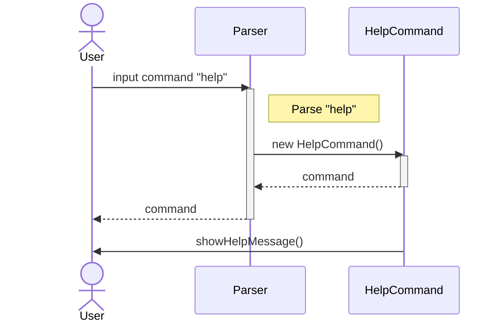

# Developer Guide

## Acknowledgements

{list here sources of all reused/adapted ideas, code, documentation, and third-party libraries -- include links to the
original source as well}

## Design & implementation

`Coinflip` (consisting of class `Coinflip`) is in charge of the app launch and shut down.

* Upon app launch, the program attempts to load key user data from a local save file
* If save file cannot be accessed or does not exist, the key user data will be assigned default values instead
* Following this, the program enters a loop which will wait for the user to key in a line of input,
  before acting on the user input accordingly
* When the correct command is given, the program will shut down

To achieve this basic flow of events, most of the program's functionalities are done by the following components:

* `Parser`: Parses user input and executes relevant commands
* `Command` and its sub-classes: Handles logic and output for each command
* `Storage`: Creates, writes to and reads from save file

These components share usage of some other common utility classes:

* `CoinflipException`: Exception class for all Coinflip related errors
* `CoinFlipFileException`: Exception class specifically for save-file related errors
* `CoinflipLogger`: Handles logging of program events for developers
* `Printer`: Handles printing of output for the user
* `UserData`: Abstraction for the user's data (number of coins, bet amounts, etc.)

## Product scope

### Target user profile

{Describe the target user profile}

### Value proposition

{Describe the value proposition: what problem does it solve?}

## User Stories

| Version | As a ... | I want to ...             | So that I can ...                                           |
|---------|----------|---------------------------|-------------------------------------------------------------|
| v1.0    | new user | see usage instructions    | refer to them when I forget how to use the application      |
| v2.0    | user     | find a to-do item by name | locate a to-do without having to go through the entire list |

## Non-Functional Requirements

{Give non-functional requirements}

## Glossary

* *glossary item* - Definition

## Instructions for manual testing

{Give instructions on how to do a manual product testing e.g., how to load sample data to be used for testing}

