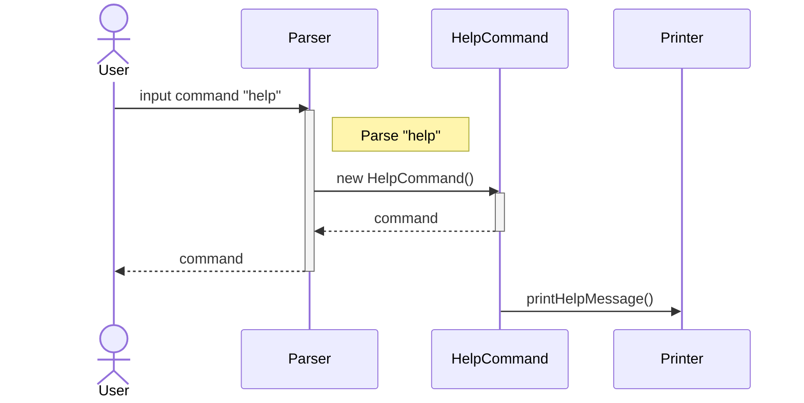

# Developer Guide

## Acknowledgements

{list here sources of all reused/adapted ideas, code, documentation, and third-party libraries -- include links to the
original source as well}

## Design & implementation

`Coinflip` (consisting of class `Coinflip`) is in charge of the app launch and shut down.

* Upon app launch, the program attempts to load key user data from a local save file
* If save file cannot be accessed or does not exist, the key user data will be assigned default values instead
* Following this, the program enters a loop which will wait for the user to key in a line of input,
  before acting on the user input accordingly
* When the correct command is given, the program will shut down

To achieve this basic flow of events, most of the program's functionalities are done by the following components:

* `Parser`: Parses user input and executes relevant commands
* `Command` and its sub-classes: Handles logic and output for each command
* `Storage`: Creates, writes to and reads from save file

These components share usage of some other common utility classes:

* `CoinflipException`: Exception class for all Coinflip related errors
* `CoinFlipFileException`: Exception class specifically for save-file related errors
* `CoinflipLogger`: Handles logging of program events for developers
* `Printer`: Handles printing of output for the user
* `UserData`: Abstraction for the user's data (number of coins, bet amounts, etc.)

## Product scope

### Target user profile

Children who are not of age to gamble

### Value proposition

The app will allow children to simulate a gambling environment without using actual money 
like some games on the App Store. This will be done by allowing them to bet in-game currency 
on a coin flip, and educate them about the dangers of gambling.

## User Stories

| Version | As a ...   | I want to ...                                       | So that I can ...                                            |
|---------|------------|-----------------------------------------------------|--------------------------------------------------------------|
| v1.0    | new player | start the game with a fixed amount of virtual money | experience the consequences of gambling                      |
| v1.0    | new player | view all the commands I can use                     | use the programme as intended                                |
| v1.0    | new player | view my current virtual money balance               | know how much I can bet on my next coinflip                  |
| v1.0    | new player | choose different betting amounts                    | see how risky bets affect my virtual balance                 |
| v1.0    | new player | randomly win or lose money when gambling            | experience the unpredictability of gambling                  |
| v1.0    | user       | continue my coin balance from my previous session   | the wins or losses from my previous bets are permanent to me |
| v2.0    | user       | view my previous coinflip results                   | see the long-term effect of my playing                       |

## Non-Functional Requirements

* Should work on any _mainstream_ OS with Java 17 installed.
* A user with decent typing speed for normal text should be able to complete most tasks faster through typing out 
commands, compared to using the mouse to navigate a GUI application.

## Glossary

* *glossary item* - Definition

## Instructions for manual testing

Viewing available commands

* Format: `help`
* Features: Shows available functions

 

Viewing balance

* Format: `check balance`
* Feature: Shows balance available to be used for betting

 

Viewing previous flips

* Format: `check history`
* Feature: Shows results of all previous coinflips

 

Viewing bet amount

* Format: `check bet`
* Feature: Shows bet amount that will be used if a bet were to be made.

 

Changing betting amount

* Format: `change NEW_BET_AMOUNT`
* Feature: Gets new betting amount from user to be used in next bet.
* Example of usage:
`change 10`

 

Playing coinflip

* Format: `flip HEADS_OR_TAILS`
* Feature: Flips a coin and either gains or loses the bet amount
* Example of usage:
`flip heads`
`flip tails`

 

Terminating programme
* Format: `exit`
* Features: Exits the programme

