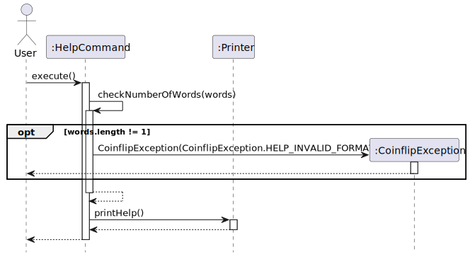
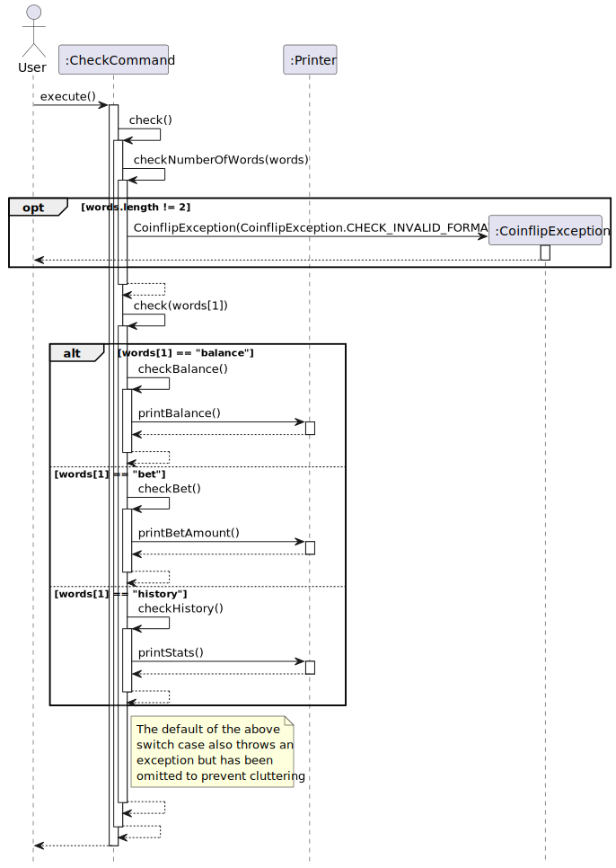
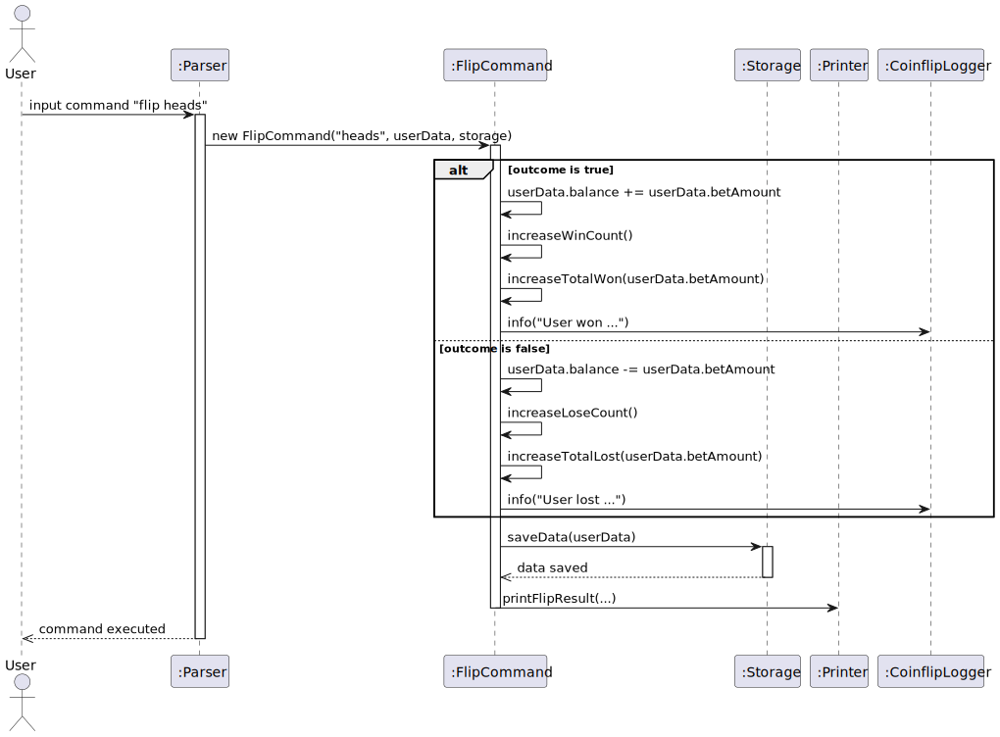
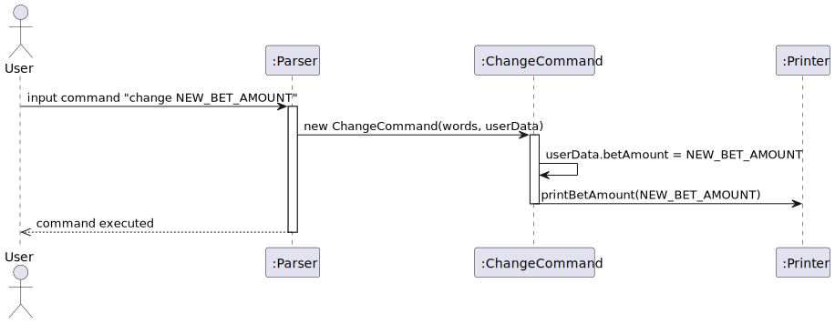
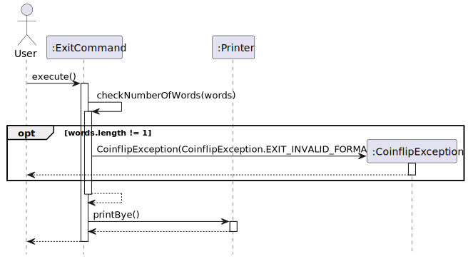

# Developer Guide

## Acknowledgements

Third-party Libraries Used for Test Cases:

* Mockito: Mocking framework to test save file loading/storing

## Design & implementation

`Coinflip` (consisting of class `Coinflip`) is in charge of the app launch and shut down.

* Upon app launch, the program attempts to load key user data from a local save file
* If save file cannot be accessed or does not exist, the key user data will be assigned default values instead
* Following this, the program enters a loop which will wait for the user to key in a line of input,
  before acting on the user input accordingly
* When the correct command is given, the program will shut down

To achieve this basic flow of events, most of the program's functionalities are done by the following components:

* `Parser`: Parses user input and executes relevant commands
* `Command` and its sub-classes: Handles logic and output for each command
* `Storage`: Creates, writes to and reads from save file

These components share usage of some other common utility classes:

* `CoinflipException`: Exception class for all Coinflip related errors
* `CoinFlipFileException`: Exception class specifically for save-file related errors
* `CoinflipLogger`: Handles logging of program events for developers
* `Printer`: Handles printing of output for the user
* `UserData`: Abstraction for the user's data (number of coins, bet amounts, etc.)

## Product scope

### Target user profile

Children who are not of age to gamble

### Value proposition

The app will allow children to simulate a gambling environment without using actual money
like some games on the App Store. This will be done by allowing them to bet in-game currency
on a coin flip, and educate them about the dangers of gambling.

## User Stories

| Version | As a ...   | I want to ...                                       | So that I can ...                                                       |
|---------|------------|-----------------------------------------------------|-------------------------------------------------------------------------|
| v1.0    | new player | start the game with a fixed amount of virtual money | experience the consequences of gambling                                 |
| v1.0    | new player | view all the commands I can use                     | use the programme as intended                                           |
| v1.0    | new player | view my current virtual money balance               | know how much I can bet on my next coinflip                             |
| v1.0    | new player | choose different betting amounts                    | see how risky bets affect my virtual balance                            |
| v1.0    | new player | randomly win or lose money when gambling            | experience the unpredictability of gambling                             |
| v1.0    | user       | continue my coin balance from my previous session   | the wins or losses from my previous bets are permanent to me            |
| v2.0    | user       | view my previous coinflip results                   | see the long-term effect of my playing                                  |
| v2.0    | user       | save my data between sessions                       | continue experiencing the effects of my actions over a long time period |
| v2.0    | user       | have a loading animation when I flip coins          | see the parallels to real-world gambling                                |
| v2.1    | user       | unlock achievements upon achieving certain actions  | feel rewarded for using the program                                     |
| v2.1    | user       | view my achievements                                | reflect on my experience playing the same                               |

## Non-Functional Requirements

* Should work on any _mainstream_ OS with Java 17 installed.
* A user with decent typing speed for normal text should be able to complete most tasks faster through typing out
  commands, compared to using the mouse to navigate a GUI application.

## Glossary

* *balance* - Number of coins possessed by the user
* *win* - When a user successfully predicts the outcome of a coin flip
* *lose* - When a user does not successfully predicts the outcome of a coin flip
* *win streak* - Number of consecutive successful coin flips performed by the user
* *lose streak* - Number of consecutive unsuccessful coin flips performed by the user

## Instructions for Manual Testing

Viewing available commands

* Format: `help`
* Features: Shows available functions

Viewing balance

* Format: `check balance`
* Feature: Shows balance available to be used for betting

Viewing statistics of previous flips

* Format: `check history`
* Feature: Shows statistics for all previous coinflips

Viewing bet amount

* Format: `check bet`
* Feature: Shows bet amount that will be used if a bet were to be made.

Changing betting amount

* Format: `change <number representing new bet amount>`
* Feature: Gets new betting amount from user to be used in next bet.
* Example of usage:
  `change 10`

Playing coinflip

* Format: `flip <heads>/<tails>`
* Feature: Flips a coin and either gains or loses the bet amount
* Example of usage:
  `flip heads`
  `flip tails`

Terminating program

* Format: `exit`
* Features: Exits the program

## Class Diagrams

Here is the class diagram for Coinflip:

## Sequence Diagrams
>Note: In the following sequence diagrams, some of the other classes (for examples, Parser and Logger), or the functions
> the other classes call, have been left out intentionally to reduce cluttering and place more emphasis on the respective 
> command classes that are being executed, along with their main functionalities.

**Viewing available commands (help function)**
 
Below are the steps taken when the user types in "help" to view all available commands, focusing on the 
`HelpCommand` class.  
Step 1: The user enters "help" into the command line.  
Step 2: The `Parser` class parses the input and creates an instance of `HelpCommand`.  
Step 3: The `execute()` method of the `HelpCommand` class is called.  
Step 4: The `execute()` method calls the `checkNumberOfWords(words)` method to ensure that exactly 1 word was entered.
Exceptions will be thrown if the input is found to have more than 1 word.  
Step 5: The `execute()` method will then call the `printHelp()` method from the `Printer` class to print the different
available commands.  
Step 6: The control is returned to the user, who is free to enter the next command.  

The following sequence diagram shows how the `HelpCommand` class is executed when the user types in "help" to view
all available commands.  

**Viewing balance, bet or history (check command)**
 
Below are the steps taken when the user types in "check ___" (where the ___ can be "balance", "bet" or "history") 
to view their balance, bet amount or history, focusing on the `CheckCommand` class.  
Step 1: The user enters "check ___" into the command line.  
Step 2: The `Parser` class parses the input and creates an instance of `CheckCommand`.  
Step 3: The `execute()` method of the `CheckCommand` class is called.  
Step 4: The `execute()` method calls the `checkNumberOfWords(words)` method to ensure that exactly 2 words were entered.
Exceptions will be thrown if the input is found to have more than or less than 2 words.  
Step 5: The `execute()` method will then call the `check(words[1])` function to check the second word of the input 
to determine which command to execute. If the second word of the input is not "balance", "bet", or "history", 
an exception will be thrown. 
Step 6: The commands that were chosen to execute will then print their respective messages.  
Step 7: The control is returned to the user, who is free to enter the next command.  

The following sequence diagram shows how the `CheckCommand` class is executed when the user types in "check ___"
(where the ___ can be "balance", "bet" or "history") to view their balance, bet amount or history.  

**Playing coinflip (flip command)**
 
Below are the steps taken when the user types in "flip heads" or "flip tails" to play a coin flip, focusing on the
`FlipCommand` class.  
Step 1: The user enters "flip heads" or "flip tails" into the command line.  
Step 2: The `Parser` class parses the input and creates an instance of `FlipCommand`.  
Step 3: The `execute()` method of the `FlipCommand` class is called.  
Step 4: The `execute()` method calls the `flip()` method.  
Step 5: The `flip()` method calls a number of functions to check the validity of the user input and ensures the user 
has sufficient balance to place the bet. Exceptions will be thrown if the input is found to be invalid or the user
is found to have insufficient balance.  
Step 6: The generateFlip() method is called to generate a random outcome of the coin flip. *The call to randomly
generate a flip has been intentionally left out from the sequence diagram to emphasise the ChangeCommand class.*  
Step 7: The `getOutcome(actualFlip, words[1])` method will then check if the user has won or lost the coin flip.  
Step 8: The `update(userData, outcome)` method of the `AchievementList` class is called to update the user's
achievements. *This function has been intentionally left out of the sequence diagram to place emphasis on the
ChangeCommand class.* 
Step 9: The `processOutcome()` method will be called, which will call other functions to update the user's data. 
*These functions have been intentionally left out of the sequence diagram so that it will be less cluttered* 
Step 10: The `printFlipOutcome(actualFlip, outcome, userData.betAmount)`, `printFlipSummary(userData)` and 
`printUnlockedAchievements(achievementList)` methods from the `Printer` class will be called to print the outcomes
of the flip and achievements obtained (if any) *The printFlipOutcome calls other functions to show an animation of
a coin flipping, but they have been left out of the sequence diagram to place emphasis on the ChangeCommand class.* 
Step 11: The data will be saved to the save file using the `Storage` class. *This step has been left out from the
sequence diagram to place emphasis on the ChangeCommand class.*  
Step 12: The control is returned to the user, who is free to enter the next command.  

The following sequence diagram shows how the `FlipCommand` class is executed when the user types in "flip heads"
or "flip tails" to play a coin flip.  

**Changing betting amount (change command)**
 
Below are the steps taken when the user types in "change BET_AMOUNT" (where BET_AMOUNT is the new amount the user 
would like to bet) to change the betting amount, focusing on the `ChangeCommand` class.  
Step 1: The user enters "change BET_AMOUNT" into the command line.  
Step 2: The `Parser` class parses the input and creates an instance of `ChangeCommand`.  
Step 3: The `execute()` method of the `ChangeCommand` class is called.  
Step 4: The `execute()` method calls the `change()` method.  
Step 5: The `change()` method calls a number of functions to check the validity of the user input and 
exceptions will be thrown if the input is found to be invalid.  
Such functions include: `checkNumberOfWords(words)`, `checkNumerical(words[1])`, `checkCanBeInteger(words[1])`, 
`checkNonNegative(betAmount)`, and `checkWithinBalance(betAmount, userData.balance)`.  
For the `checkNonNegative(betAmount)` and `checkWithinBalance(betAmount, userData.balance`, `words[1]` is converted 
from a string to an integer and stored in the `betAmount` variable.  
Step 11: Once the BET_AMOUNT has been confirmed to be valid, the `change()` method will set the `betAmount` variable
in userData to be the BET_AMOUNT specified by the user. 
Step 12: The `change()` method will then call the `printBetAmount()` method from the `Printer` class 
to print the message confirming the change in bet amount.  
Step 13: The data will be saved to the save file using the `Storage` class. *This step has been left out from the
sequence diagram to place emphasis on the ChangeCommand class.*  
Step 14: The control is returned to the user, who is free to enter the next command.  

The following sequence diagram shows how the `ChangeCommand` class is executed when the user types 
in "change BET_AMOUNT" to change the betting amount.  

**Terminating program (exit command)**
 
Below are the steps taken when the user types in "exit" to terminate the program, focusing on the `ExitCommand` class.  
Step 1: The user enters "exit", or "exit ___"  (where the ___ can be input like other words) into the command line.  
Step 2: The `Parser` class parses the input and creates an instance of `ExitCommand`.  
Step 3: The `execute()` method of the `ExitCommand` class is called.  
Step 4: The `execute()` method calls the `checkNumberOfWords(words)` function to check if the number of words is 1. 
If the user entered "exit ___", or any other input with more than 1 word, an exception will be thrown.  
Step 5: The `execute()` method will call the printBye() method from the `Printer` to print the exit message.  
Step 6: The `isExit` boolean will then be set to true and the programme will be terminated.  

The following sequence diagram shows how the `ExitCommand` class is executed when the user types in "exit" to terminate 
the program.  
