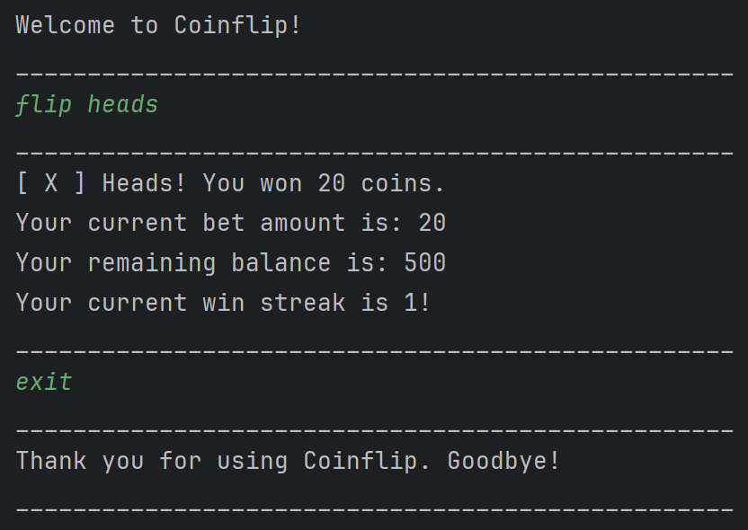

# User Guide



## Introduction

Welcome to Coinflip! Instead of becoming addicted to spending real money on App Store games
betting on loot boxes, learn how gambling eventually leads to ruin in a safe, controlled and fun environment.

Coinflip simulates a gambling environment using a simple coin flip game,
but takes away the risk and danger of actual gambling.

## Table of Contents

* [Quick Start](#quick-start)
* [Features](#features)
    * [Viewing available commands: `help`](#viewing-available-commands-help)
    * [Viewing balance: `check balance`](#viewing-balance-check-balance)
    * [Viewing statistics for previous flips: `check history`](#viewing-statistics-for-previous-flips-check-history)
    * [Viewing bet amount: `check bet`](#viewing-bet-amount-check-bet)
    * [Changing betting amount: `change`](#changing-betting-amount-change)
    * [Playing coinflip: `flip`](#playing-coinflip-flip)
    * [Terminating program: `exit`](#terminating-program-exit)
    * [Starting a new game: `reset`](#starting-a-new-game-reset)
* [Frequently Asked Questions (FAQ)](#frequently-asked-questions-faq)
* [Command Summary](#command-summary)

Please refer to the FAQ section for questions on the program's expected behaviour.

## Quick Start

1. Ensure you have Java ```17``` or above installed in your Computer.
2. Download the latest .jar file from [here](https://github.com/AY2425S2-CS2113-F13-1/tp/releases).
3. Copy the file to the folder you want to use as the *home folder* for your coinflip programme.
4. Open a command terminal, ```cd``` into the folder you put the jar file in, and use the ```java -jar tp.jar```
   command to run the programme.
5. Type in a command and press Enter to execute it.  
   Some example commands you can try:
    - ```help```: Shows a list of executable commands
    - ```check balance```: Checks remaining balance
    - ```check bet```: Checks betting amount
    - ```exit```: Terminates programme

## Features

### Viewing available commands: `help`

Shows available functions

Format: `help`

Example of usage:

`help`

### Viewing balance: `check balance`

Shows balance available to be used for betting

Format: `check balance`

Example of usage:

`check balance`

### Viewing statistics for previous flips: `check history`

Shows statistics for all previous coinflips

Format: `check history`

Example of usage:

`check history`

### Viewing bet amount: `check bet`

Shows bet amount that will be used for your coin flips.

Format: `check bet`

Example of usage:

`check bet`

### Changing betting amount: `change`

Sets betting amount to be used in subsequent flips.

Format: `change <number representing new bet amount>`

Example of usage:

`change 10`

### Playing coinflip: `flip`

Wager your bet amount on the outcome of a coin flip (heads or tails).

If you bet on the right outcome, you will win your bet amount. Otherwise, you'll lose it!

Format: `flip <heads>/<tails>`

Example of usage:

`flip heads` or `flip tails`

### Terminating program: `exit`

Exits the program

Format: `exit`

Example of usage:

`exit`

### Starting a new game: `reset`

This command lets you start a new game,
resetting your balance to 500 coins
and bet amount to 20 coins.

Format: `reset`

Example of usage:

`reset`

## Frequently Asked Questions (FAQ)

**Q**: Can I place extra words after my commands? (e.g. `check bet yay`)

**A**: No, they will be rejected as invalid commands.

**Q**: Can I bet with 0 coins? Can I bet when I have 0 coins?

**A**: The answer to both questions is **yes**. If you find yourself continuing to flip, even when you know
it's a futile endeavour, you're addicted! Use this experience to think about how dangerously addictive gambling is.

However, if you'd like to share Coinflip, or try different strategies under the belief that "there's a way to win",
you can reset your coin balance using the `reset` command.

**Q**: Will my data be automatically saved when I exit the program?

**A**: Yes, it will be saved in a save file.

**Q**: How do I transfer my data to another computer?

**A**: When you start Coinflip for the first time, there will be a `data` folder
in the same directory as Coinflip's .jar file.
Transfer this folder to the same directory as the .jar on the other computer,
and your save data will be transferred.

**Q**: Can I edit the save file?

**A**: Yes, the user data is stored in a .csv file in the `data` folder.
However, if our program detects that the save file is corrupted or in an incorrect format,
it will ignore the save file and start a new game. This is not a bug.

**Q**: If I swap column labels in the save file, will the data still be loaded correctly?

**A**: The column labels in the first line of the .csv file are there for the user to have
a reference for the correct ordering of data in subsequent rows.

If the user swaps the column labels, the program will still load data according to the
original column order, and the save file will overwrite the column labels to the original state upon the next save.

Since there is no reason to require them swapped, this is not a bug.

**Q**: What is the correct format for the save file?

**A**: The second row contains a sequence of numbers corresponding to their column labels. As a reference, you can start
Coinflip and look at the save file. There are also additional restrictions:

* All values must be separated using commas `,` without spaces between them
* All values must be non-negative integers typed out numerically (e.g. `50`, not `fifty`)
* All values must be lower than 10 digits in length
* Either the `Current Win Streak` or `Current Lose Streak` value must be 0.

If these conditions are not met, the program will attempt to detect the file corruption, but it is not guaranteed
to do so, and this is expected behaviour.

The reason is that the text commands already provide all expected user functionality, and the program creates
correctly formatted save files, so handling user modification is out of scope.

**Q**: What happens if I played such that my balance exceeds 9 digits in length? E.g. `1000000000`

**A**: It will be capped at `999999999` if it exceeds `999999999`. The same goes for all other numerical values shown in
the game.

## Command Summary

| Action                  | Command                   |
|-------------------------|---------------------------|
| View available commands | `help`                    |
| View coin balance       | `check balance`           |
| View flip statistics    | `check history`           |
| View bet amount         | `check bet`               |
| Change bet amount       | `change <new bet amount>` |
| Perform a coin flip     | `flip <heads>/<tails>`    |
| Exit program            | `exit`                    |
| Start a new game        | `reset`                   |